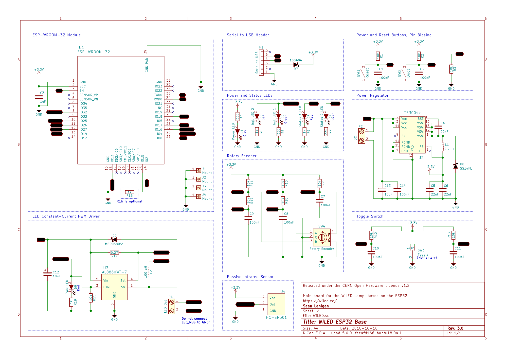
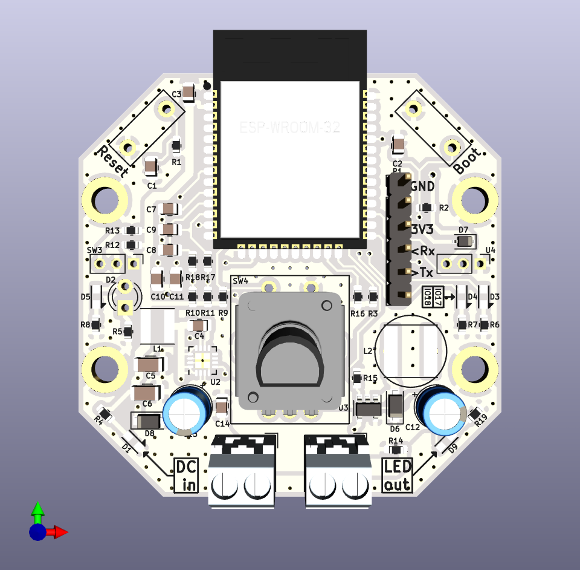
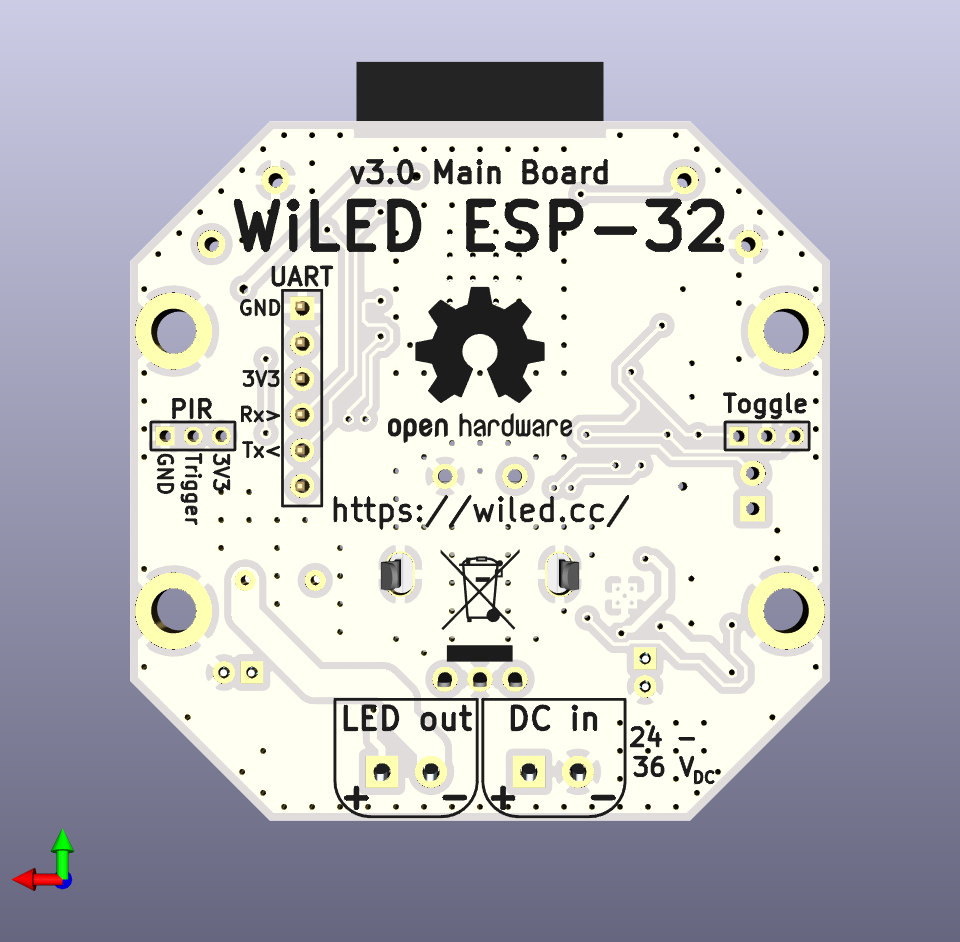

# WiLED: PCB files

Circuit schematic and PCB for the WiLED main board, based on the ESP32 (ESP-WROOM-32) module. New version 3.0 of the board is an upgrade from the ESP8266-based version 1.0, but features improved layout and on-board LED driver components.

# Licence

All hardware schematics and design files are released under the CERN Open Hardware Licence v1.2. Please see [LICENCE](LICENCE) for details.
